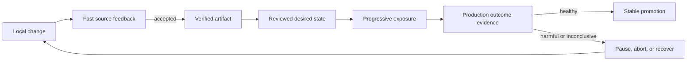

# 01 — Build Fast Feedback You Can Trust

> **Outcome:** Treat **CI (Continuous Integration)** as a production feedback system, then implement a pipeline whose ordering, critical-path latency, authority, build input, and continued conformance can be verified.

**Current Northwind state:** `storefront-api` has a health contract and a small test suite. Its pipeline is slow, noisy, and allowed to do too much.  
**Prerequisites:** Python 3.12, Git, and workflow-syntax familiarity; Docker is optional.  
**Implementation:** `books/labs/devops/northwind/`  
**Guided time:** approximately 90–120 minutes.

## 1. A cheap failure delivered late

Northwind's checkout team made six changes last week. Four were correct on the first attempt. Two failed lint, but engineers waited more than twenty minutes to learn that because the pipeline built a container first.

| Signal | Current value |
|---|---:|
| Feedback **p50 (50th percentile)** | 18 minutes |
| Feedback **p95 (95th percentile)** | 31 minutes |
| Queue time at p95 | 10 minutes |
| Flake rate | 7% |
| Build context | 1.4 gigabytes |
| Cheap lint and test work | 165 seconds |

Engineers concluded that hosted runners were too slow. Runner utilization looked ordinary, however, and larger runners would not make lint execute before the container build.

> Why does feedback take 31 minutes when lint and tests finish in under three?

> **Practice — Establish the red baseline**
>
> Check out the real unsafe state and prove that its feedback, context, and authority contracts are failing for known reasons.

The implementation repository carries a deliberately unsafe starting state. Enter it and create your working branch:

```bash
cd books/labs/devops/northwind
git switch -c my-chapter-01 chapter-01-start
python3.12 -m venv .venv
source .venv/bin/activate
make bootstrap
make chapter-01-baseline
```

The command should succeed while reporting that the capability is red. It derives that result from the checked-out workflow, pipeline graph, and Docker context: the budget is exceeded, expensive work precedes cheap checks, generated build input is uncontrolled, and the workflow requests package-write permission. A baseline command should distinguish an expected red state from a broken checkpoint.

## 2. The production model: CI is a feedback system

> *Theory — Trustworthy feedback under production constraints*
>
> Build the mental model needed to choose job order, diagnose latency, and constrain workflow authority.

CI does not primarily produce green check marks. It produces evidence about a proposed change. Useful evidence must arrive quickly enough to influence the next action and be reliable enough that engineers do not rerun it reflexively.

```text
change
  |
  v
cheap checks --> focused tests --> artifact work --> security evidence
  |                  |                  |
  +------ stop at the first useful failure -------+
```

The developer journey continues beyond this chapter. One change moves through distinct evidence and authority boundaries rather than one all-powerful pipeline:



Chapter 1 owns the first feedback boundary. Chapter 2 establishes artifact identity, Chapter 6 supplies production evidence, Chapter 7 makes that evidence control exposure, and Chapter 10 closes the reviewed reconciliation path. Later chapters add data, asynchronous work, cost, incident, and restoration constraints without replacing this journey.

Four mechanisms matter:

- **Ordering:** cheap, high-signal checks reject bad changes before expensive work.
- **Latency evidence:** queue and execution time are measured separately.
- **Reliability:** a flaky check consumes time without increasing confidence.
- **Authority:** pull-request workflows processing untrusted changes do not receive write or deploy authority. Chapter 2 will add publication through a separately guarded release path.

### Measure the path a change actually waits for

A pipeline is a **DAG (Directed Acyclic Graph)**: jobs are nodes and dependency relationships are edges. The elapsed execution time is determined by the longest dependency path, not the sum of all job durations.

For a path containing jobs `j1 ... jn`, Northwind models feedback time as:

```text
feedback time = queue time + duration(j1) + ... + duration(jn)
```

The pipeline's critical path is the path with the largest result. Two independent five-minute jobs can complete in roughly five minutes when capacity is available; making them parallel does not help when both wait ten minutes for a runner. Northwind therefore measures queue time separately and optimizes the shortest path that still produces enough trustworthy evidence—not the shortest pipeline at any cost.

The ten-minute p95 budget and 200-megabyte context limit used here are Northwind constraints, not universal targets. Repository checkout, artifact transfer, runner startup, cancellation, and retries can also add latency in a real measurement.

### Treat workflow authority as part of execution

A workflow executes repository-controlled code. On a pull request, that code may be supplied by a contributor who should not be able to publish packages, change deployments, or mint privileged credentials. Permissions therefore belong in the pipeline model alongside dependencies and durations.

The safe default is read-only authority with narrower permissions granted only to the job that needs them. Environment approval does not compensate for giving an earlier untrusted job broad credentials: authority must be constrained at the point where code executes.

## 3. Implement the feedback contract

### Establish the application boundary

> **Practice — Verify the behavior CI must protect**
>
> Run the service tests and identify the application contract that later pipeline changes must preserve.

CI needs real behavior to protect. `storefront-api` currently exposes liveness and catalog endpoints; later chapters add orders and stateful dependencies.

```bash
python -m pytest services/storefront-api/tests -q
```

The tests prove that liveness reports process health, catalog data satisfies its minimal contract, and unknown routes return `404`. Component tests stay with the service. Cross-component tests enter the repository only when those boundaries exist.

### Put cheap evidence first

> **Practice — Diagnose the 31-minute critical path**
>
> Calculate the baseline manually, compare it with the analyzer, and then redesign the dependency graph.

Open `delivery/pipeline.json`. Before running the analyzer, use the model above to diagnose the start state. Its only dependency path is:

```text
queue → build → lint → test
600 + 1095 + 35 + 130 = 1860 seconds = 31 minutes
```

Now compare your calculation with the executable model:

```bash
python tools/pipeline_feedback.py \
  --pipeline delivery/pipeline.json \
  --budget-seconds 600 \
  || echo "feedback_budget_exceeded_as_expected"
```

The report should agree with 1,860 seconds. If it does not, inspect the dependencies rather than adjusting the formula to fit the output. This diagnostic separates the 600-second queue delay from the 1,260-second execution path and shows that larger runners alone cannot repair the ordering problem.

The start state puts `build` before `lint`, reproducing the late cheap failure. Edit the dependency graph so that lint must succeed before tests, and tests must succeed before build. The completed graph is:

```json
{
  "stages": [
    {"name": "lint", "seconds": 35, "needs": []},
    {"name": "test", "seconds": 130, "needs": ["lint"]},
    {"name": "build", "seconds": 220, "needs": ["test"]}
  ],
  "queue_seconds": 40
}
```

```bash
python tools/pipeline_feedback.py \
  --pipeline delivery/pipeline.json \
  --budget-seconds 600
```

It reports a 425-second queue-plus-critical path: lint rejects cheap defects, tests establish behavior, and only then does build spend container resources. The analyzer follows the dependency graph rather than adding every job, so independent checks can run concurrently without falsifying the budget.

This linear path fits today's small service. Larger repositories may run independent test groups concurrently after a common cheap gate. Parallelism is useful only when it shortens the critical path without creating excessive queue demand or obscuring evidence.

### Make workflow authority explicit

> **Practice — Remove publication authority from pull requests**
>
> Change the workflow to read-only authority and make its dependency order agree with the pipeline model.

The starting workflow grants `packages: write` globally. That permission is unnecessary because Chapter 1 does not publish anything. Edit `.github/workflows/ci.yml` so the workflow default is read-only:

```yaml
permissions:
  contents: read
```

A pull request can modify scripts executed by CI. Giving every job package authority turns pipeline code into a privilege-escalation path. Remove `packages: write` rather than preserving unused authority for a future chapter. `.github/CODEOWNERS` records the review boundary; repository settings must enforce code-owner review and branch protection for it to become a real control.

While editing the workflow, express the same fail-fast graph as the pipeline model: `test` needs `lint`, and `build` needs `test`. The model makes offline reasoning deterministic; the workflow is the executable delivery definition. The checkpoint requires them to agree on the important constraints.

### Detect drift from the reviewed workflow contract

Reusable workflows and repository templates reduce duplication, but copying a template once does not keep a service safe. A repository may later remove a required job, bypass an edge, restore write authority, or retain an obsolete template version while still producing valid workflow syntax.

Open `delivery/workflow-conformance.json`. It defines the small interface Northwind expects every service workflow to preserve: template identity, required jobs and dependency edges, evidence-producing commands, read-only default authority, and forbidden write permissions. It deliberately does not require byte-for-byte equality. A service may add workload-specific checks as long as it preserves the reviewed interface.

Add `# northwind-template: ci-v1` to `.github/workflows/ci.yml`, then run the conformance check:

```bash
make chapter-01-template
make chapter-01-template-drift
```

The first command checks the actual workflow. The second evaluates a syntactically plausible fixture that advertises `ci-v0`, lets tests bypass lint, and restores package-write authority. It succeeds only when that drift is rejected. The contract is owned like production code: changing `ci-v1` requires review and a migration decision for consuming repositories. This is lightweight conformance, not an internal developer platform; Chapter 10 later reconciles reviewed environment intent.

### Bound hidden build input

> **Practice — Reject uncontrolled build context**
>
> Observe the generated input crossing the context boundary, exclude it deliberately, and prove the transmitted context is back inside budget.

The baseline creates a sparse `build-output/cache.bin` representing 1.4 gigabytes of generated build output. It consumes almost no physical disk, but its logical size accurately exercises context selection. Run the context gate before changing `.dockerignore`:

```bash
python tools/context_gate.py --root . --limit-bytes 209715200 \
  || echo "context_rejected_as_expected"
```

Now add `build-output` to `.dockerignore` and run the same gate again:

```bash
python tools/context_gate.py --root . --limit-bytes 209715200
```

`context_gate.py` reads the repository's `.dockerignore` rather than maintaining a separate exclusion list. The new result must exclude `build-output/cache.bin` and pass before Docker uploads context or consumes a remote builder. The sample patterns are deliberately simple; if your production ignore file uses advanced negation or Docker-specific matching, verify the transmitted context with the actual builder as well.

### Prove the capability

> **Practice — Verify the complete feedback contract**
>
> Run one capability checkpoint that checks behavior, ordering, latency, context selection, and workflow authority together.

```bash
make chapter-01-checkpoint
```

The checkpoint verifies application behavior, dependency ordering, the calculated critical-path budget, Docker-context rules, read-only workflow authority, continued workflow-template conformance, and absence of a floating `latest` tag.

The local fixture does not prove GitHub's real p95. Production must export workflow and queue events, calculate rolling percentiles, and retain the commit and workflow revision associated with every sample.

## 4. Test the design under failure

**Severity:** delivery degradation; no production outage.  
**Potential blast radius:** pull-request feedback for one repository.  
**Bounded by:** a feedback-budget gate and publication authority withheld from pull requests.  
**Primary principles:** trustworthy evidence and blast-radius control.

> **Practice — Diagnose and recover from queue regression**
>
> Increase only queue delay, identify which part of feedback time changed, and restore the budget without weakening other controls.

Assume runner demand rises after the pipeline is repaired. In `delivery/pipeline.json`, temporarily change `queue_seconds` from `40` to `400`. Before running anything, calculate the expected result:

```text
400 queue + 385 execution = 785 seconds
```

Run the analyzer:

```bash
python tools/pipeline_feedback.py \
  --pipeline delivery/pipeline.json \
  --budget-seconds 600 \
  || echo "queue_regression_detected_as_expected"
```

The critical path has not changed, so reordering jobs or buying faster build compute addresses the wrong component. The evidence isolates a 360-second queue regression. In production, the repair might be concurrency shaping, runner-pool capacity, or workload scheduling; the fixture represents that recovery by restoring `queue_seconds` to `40`.

```bash
make chapter-01-checkpoint
```

Recovery is not merely the analyzer returning zero. The checkpoint must still show the intended order, total time inside the teaching budget, clean context, green application tests, and narrow authority. A capacity repair that weakens those controls is not recovery.

## 5. Production reality

**Best Practice:** run cheap, high-signal checks early and cache deterministic dependencies.

**Production Practice:** measure the real critical path. An expensive integration test may carry the evidence that prevents costly failure. Move it later; do not delete it merely to improve a dashboard.

| Condition | Likely response |
|---|---|
| Queue p95 grows while execution is stable | Reshape runner capacity and concurrency. |
| Execution grows while queue remains stable | Inspect stage work, cache behavior, test selection, and build input. |
| Flake rate grows | Assign ownership, quarantine only with expiry, and repair nondeterminism. |

Cache keys are trust decisions. Untrusted pull requests must not poison caches later consumed by privileged release jobs. Hosted actions and reusable workflows are dependencies too; pin them according to the supply-chain policy developed in Chapter 2.

Production evidence should retain queue and execution duration, result and rerun state, workflow and commit identity, cache outcome, protected-branch context, and estimated runner cost. These measures describe the delivery system; do not turn them into individual-engineer rankings.

## 6. What changed

| Before | After |
|---|---|
| Expensive work ran before lint. | Cheap evidence rejects changes first. |
| A 1.4-gigabyte context looked like generic slowness. | Context is measured and rejected before upload. |
| Queue and execution delay were conflated. | The feedback report exposes both. |
| Pull-request code had unused package authority. | Chapter 1 is read-only; Chapter 2 will add a guarded release path. |
| A copied workflow could silently drift from its reviewed defaults. | A versioned conformance contract preserves required evidence, ordering, and authority while allowing service-specific additions. |
| Pipeline speed was an opinion. | A behavioral checkpoint enforces an explicit contract. |

What mattered was not GitHub Actions syntax. Northwind changed CI from a command sequence into a measurable feedback contract with constrained authority.

## Durable outputs

| Artifact | Location | Keep it because |
|---|---|---|
| Reviewed delivery contracts | `delivery/pipeline.json` and `delivery/workflow-conformance.json` | They record the feedback budget and the required workflow interface without forcing every repository to be an identical copy. |
| Pipeline conformance evidence | `evidence/chapter-01-green.json` | Retain the generated report with workflow and revision identity so a later regression can be compared with the last accepted ordering, authority, context, template, and latency evidence. |

## What You Learned

Fast feedback is a production contract, not merely a short list of commands. You can now calculate the critical path, separate queue delay from execution time, order evidence by cost and value, constrain pull-request authority, reject uncontrolled build context, detect workflow-template drift, and diagnose a feedback-budget regression without weakening the controls that make the result trustworthy.

### Prove It

> **Independent Practice — Preserve evidence under a tighter budget**
>
> Design and justify a production pipeline without copying the guided topology.

Northwind adds a 12-minute integration suite that catches payment-contract regressions missed by unit tests. Running it on every change breaks the ten-minute budget; running it nightly lets incompatible changes merge.

Design a pipeline that preserves fast feedback without discarding the evidence. Specify which checks block every pull request, which work runs concurrently, whether change-aware selection is safe, what blocks merge or promotion, how flakes are owned, and how you will show that lead time improved without increasing change failures.

## Next

Northwind can reject bad source changes quickly. It still cannot prove that staging and production receive the artifact CI tested. Chapter 2 establishes immutable artifact identity and promotion without rebuilding.
